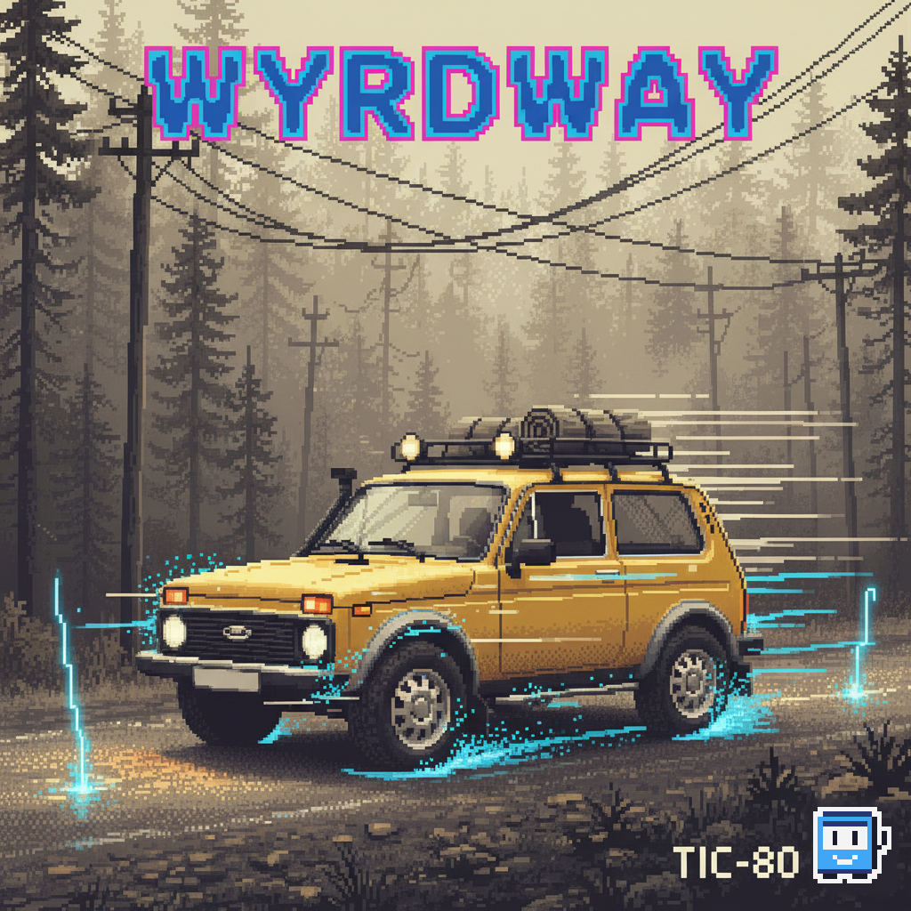
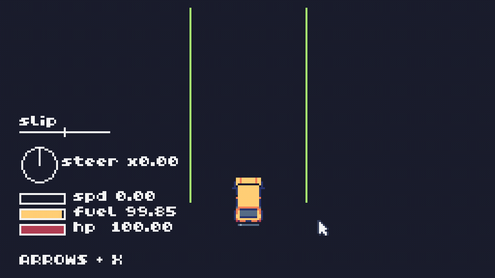

# Wyrdway
Wyrdway — a content-driven road-trip roguelite game for [TIC-80 fantasy computer](https://tic80.com/): drive between strange POIs, do quick loot raids, extract, and upgrade your car in the garage to survive escalating anomalies.

## Gameplay record (early WIP)

## Game Design Document (lang: RU)
- [gdd_v0.md](docs/00_spec/0_gdd_v0.md) — early proto

## Repo layout
- `tic80/python/main.py` — game entry point (Python TIC-80).
- `tic80/python/game.py` — TIC-80 cart resources (sprites/sfx/etc); avoid editing directly.
- `tic80/python/build.py` — bundler output; do not edit.
- `docs/` — design and architecture references.

## Run & build (Windows)
- `run_tic80_python.bat` — bundle `game.py` + `main.py` and launch TIC-80.
- `run_tic80_python.bat build` — bundle only (no emulator).

---

# Wyrdway

Wyrdway — контент‑ориентированный road‑trip roguelite для [фэнтези‑компьютера TIC‑80](https://tic80.com/): путешествуйте между странными точками интереса, делайте короткие вылазки за лутом, эвакуируйтесь и улучшайте машину в гараже, чтобы пережить нарастающие аномалии.

## Дизайн-документ

* [gdd_v0.md](docs/00_spec/0_gdd_v0.md) — ранний прототип
